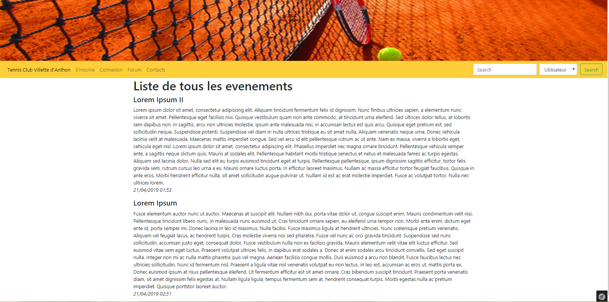
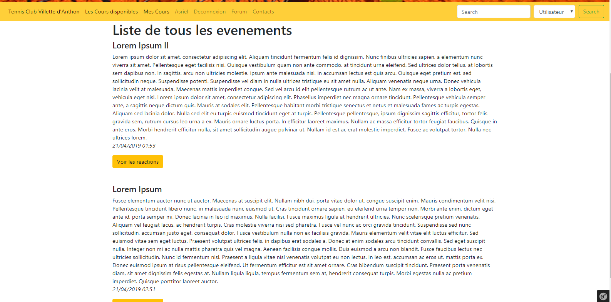
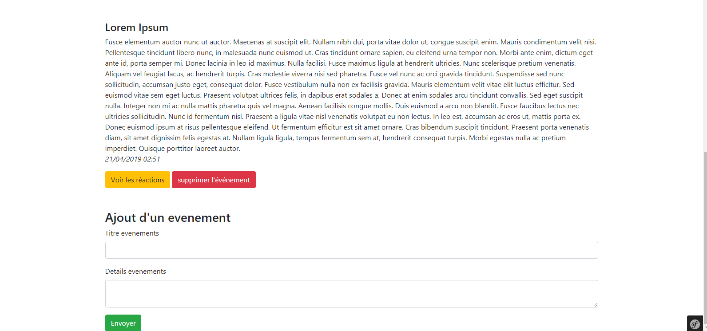
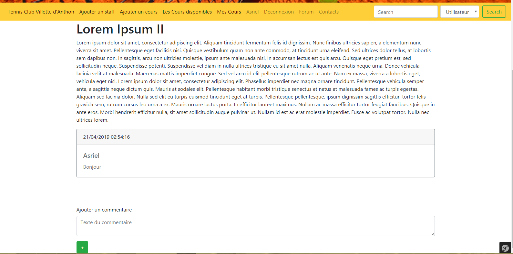
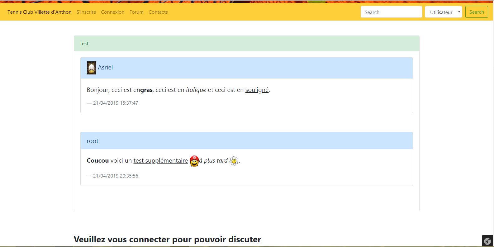
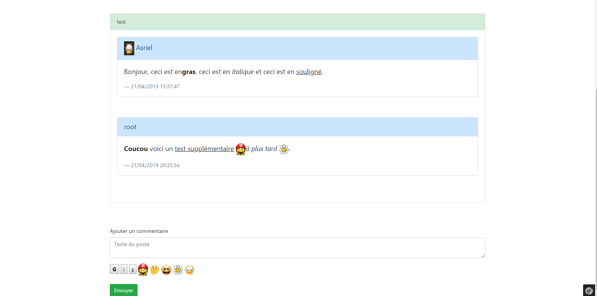
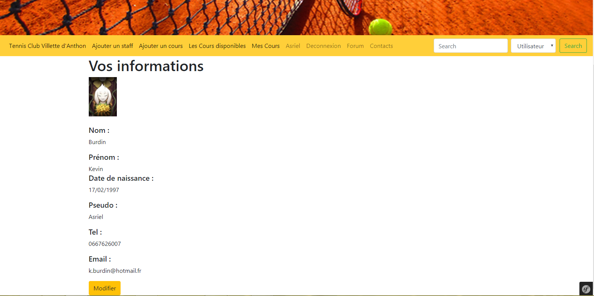
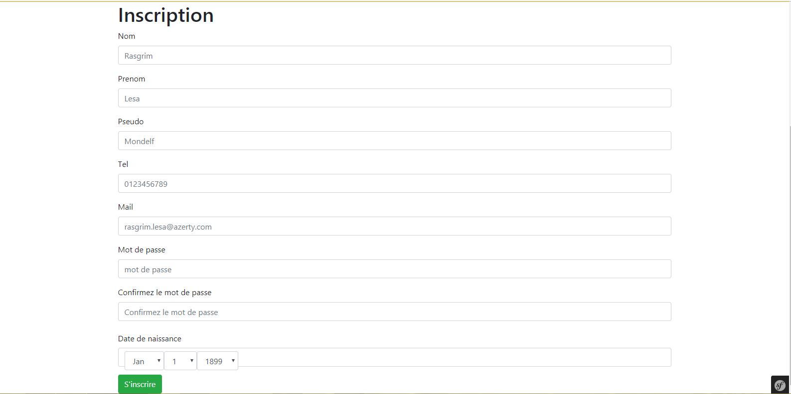

# Projet de MARTINEZ Jennifer 11502280, GEORGES Baptiste 11607546, ALCARAZ Benoît 11608160, BURDIN Kevin 11507706.

## Objectif : Site web pour un club de tennis.

## Prérequis : Apache, MySQL, PHP avec une version récente, Composer.

## Installation : 

Lancer le serveur Apache, MySQL et PHP.
Se placer dans symfony/tennis_club et installer les composants requis avec ces lignes de commandes :
```
composer install (Attention, peut prendre plusieurs minutes)

composer require server --dev
	
php bin/console doctrine:create:database
	
php bin/console make:migration
	
php bin/console doctrine:migrations:migrate
	
composer require orm-fixtures --dev
```

Il est possible de lancer le serveur une fois installé :
```
php -s @IP:port -t (...chemin relatif...)/public
```
OU ALORS

Il est possible de lancer le serveur du site en local : 
```
php bin/console server:run
```


# Captures d'écran du projet :


## Accueil sans connexion


## Accueil connexion utilisateur



## Accueil connexion administrateur


## Commentaires article


## Forum sans connexion


## Forum avec connexion


## Informations d'un utilisateur


## Inscription d'un utilisateur
